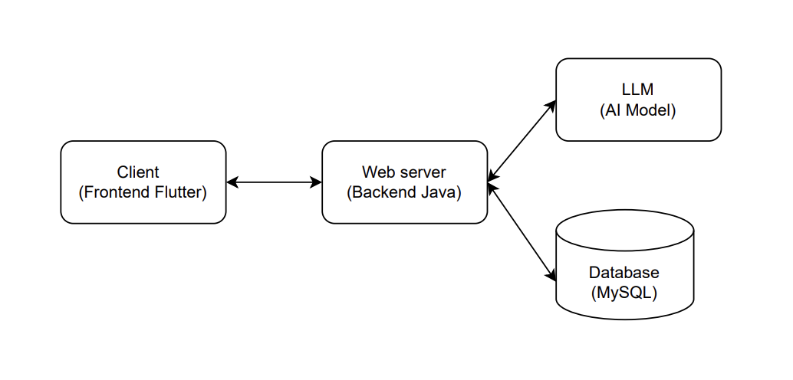

# Calories

Calories is a cross-platform mobile application built with Flutter that allows users to take a photo
of their meal and get detailed nutritional information using Gemini AI. The backend is powered by
Spring Boot,
which handles image processing and calorie estimation.

### Architecture



### How to run the app locally

- Clone the git repository from the Github to your local machine. You can do this by

  ```
  git clone https://github.com/Atharva0418/Calories.git
  ```

- Frontend Setup

  - Install
    flutter [Flutter official website](https://docs.flutter.dev/get-started/install?_gl=1*rhwsg3*_gcl_aw*R0NMLjE3NTAxNzEzMTQuQ2p3S0NBandwTVRDQmhBLUVpd0FfLU1zbVRMemFMek9XRHhXb20zLXVqWVVjTEt1d3BscVJFYWFuTTNYZ2oyTGMtSlZoZl85SjJJM2J4b0NlWFVRQXZEX0J3RQ..*_gcl_dc*R0NMLjE3NTAxNzEzMTQuQ2p3S0NBandwTVRDQmhBLUVpd0FfLU1zbVRMemFMek9XRHhXb20zLXVqWVVjTEt1d3BscVJFYWFuTTNYZ2oyTGMtSlZoZl85SjJJM2J4b0NlWFVRQXZEX0J3RQ..*_ga*MTE5NDU5NTM4NS4xNzQyNjM4MDM1*_ga_04YGWK0175*czE3NTAxNzEzMDQkbzckZzEkdDE3NTAxNzEzMjEkajQzJGwwJGgw)
    .Download according to your OS.

  - Install Android Studio
    from [Android official website](https://developer.android.com/studio?gad_source=1&gad_campaignid=21831783552&gbraid=0AAAAAC-IOZmw651yZRRJjFX5CiEWInWFE&gclid=CjwKCAjwpMTCBhA-EiwA_-MsmW_R42x1Pl7ZB6Cy-EBcngjBRx9jUxmUcali4tN1-kHjZbiyZF0aPBoC9YQQAvD_BwE&gclsrc=aw.ds).
    Download according to your OS.

  - To install dependencies, simply run the following command.

    ```
    flutter pub get
    ```

  - Create an emulator device in Android Studio.

    - Open Android Studio > Tools > Device Manager
    - Click + Create Device
      - Choose a device of your choice.
      - Choose VanillaIceCream system Image.(You can choose any other image as well.)

  - Before running the app, make an .env file in the "Calories" directory and add the folllowing details in it.The "X-API_KEY" must be same in both the frontend and the backend.

    ```
    BASE_URL=http://10.0.2.2:8080
    X_API_KEY=<random-api-key>
    ```

  - Launch the emulator from Device Manager.

  - Run the following command to check the connected devices.
    ```
    flutter devices
    ```
  - Run the app by the following command.

    ```
    flutter run -d <name of the device>

    e.g
    flutter run -d emulator-5554
    ```

    Or you can run the app by the Run button on the top right.

- Backend Setup

  - Install Docker from [Docker official website](https://docs.docker.com/get-started/get-docker/). Download according to your OS.

  - Build the Docker Image with this command. Make sure the terminal is in the following directory "/Calories/calories-backend". The docker engine should be running before running this command. (Simply open docker desktop to boot the docker engine).
    ```
    docker build -t calories-backend:latest .
    ```
  - Before running the server, make an .env file in the "calories-backend" directory and add the folllowing details in it.The "X-API_KEY" must be same in both the frontend and the backend.

    ```
    MODEL_API_KEY=<your_gemini_api_key>
    API_URL=<your_gemini_api_url>
    X_API_KEY=<random_api_key>
    ```

  - Use the following command to run the services defined in the `docker-compose.yml` file. (Docker engine must be running.)
    ```
    docker compose up
    ```
